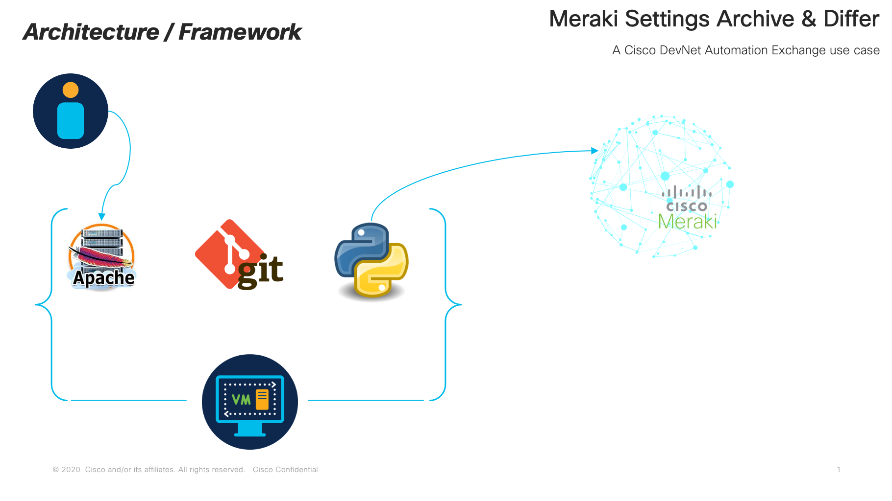
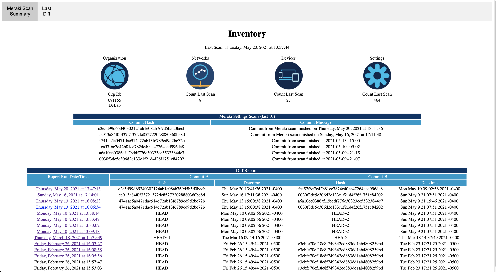
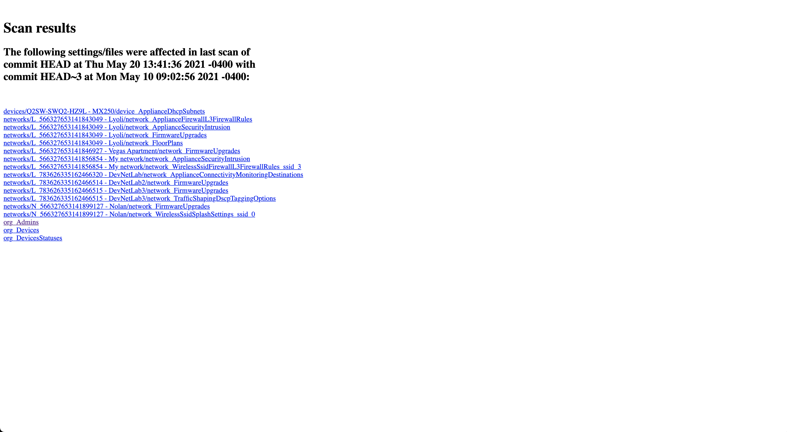
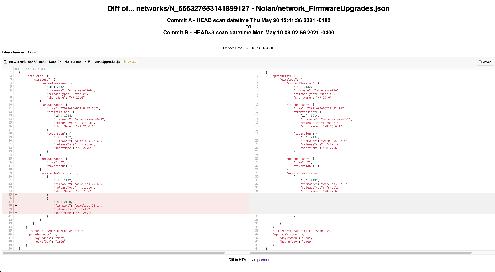

# Meraki Settings Archive & Differ (MSA&D)

The Meraki Settings Archive & Differ project extracts Meraki device settings from the Meraki Dashboard API, stores as JSON files in a local git repo and creates web pages showing differences betweeen scans in colorized form.

The business driver for developing this was for Cisco customers that may have sophisticated IT Service Management requirements and also use cloud-managed Meraki equipment.  The solution archives the settings into a local git repo allowing for archive and difference analysis.  This solution is the foundation for possible follow-on functionality, such as settings scans for compliance.  As the settings are stored in feature-specific JSON files, it is easy to write JSON Path Queries to check for compliance to your corporate standards or any other compliance framework (eg. HIPAA, PCI/DSS, Basel II/III, FIPS, etc).  Note, the code in the current project does not provide those rules or functionality.  It is expected that Cisco Customer Experience (CX) will be releasing a service that performs the compliance specific function.

* Technology stack: Python, REST APIs, Meraki Dashboard API, HTML/CSS
<kbd></kbd>
Figure 1 - Meraki Settings Archive & Differ architecture/framework


* Status:  v1 (Released to Automation Exchange 07/01/2021)
* Screenshots: 

<kbd></kbd>
Figure 2 - Main Meraki Scan Summary web page

<kbd></kbd>
Figure 3 - Individual Scan Results web report

<kbd></kbd>
Figure 4 - Feature/Setting-specific Diff report

## Use Case Description

Meraki equipment is cloud-managed and access via the Meraki web portal. It doesn't have a traditional configuration file in the sense of IOS-XE, IOS-XR, NX-OS, etc. Some IT environments that embrace ITSM, ITIL and TOGAF methodologies may require archive of device settings for disaster recovery, difference analysis and compliance scanning. This project queries the latest Meraki OpenAPI specification and works from a CSV of known API end-points, extracting all readable (GET) end-points and storing them as JSON file objects in a local git repository.  The organization, network and device hierarchies are obtained and stored in a file directory structure per organization identifier (orgid).  Scan dates, times and git commit hashs are collected and reported in a web report for reference.

Difference scans can be initiated against latest and previous scan (git HEAD and HEAD~1) or any combination of scanned instances.  Difference reports are logged to a summary web page for easy reference with clickable links to the specific difference scan results.  Individual different reports show all feature category changes, eg. orgAdministrators, and can be individually clicked for review, showing differences in a colorized side-by-side report.


## Installation

Two options are provided: self-directed installation with requirements OR Docker.  Pick whichever suites your preference, security requirements and deployment capabilities.
When running as a self-directed installation with requirements, it is suggested to run this project in its own Linux Virtual Machine.  Development was done on CentOS Stream 8.3, but releases at or above the 7 train or other Linux variants should be fine.
Additionally, Apache and Python environments should be installed - CentOS may have provided one in your installation.  Our guidance is to keep the system-supplied version and install the latest Python and use virtual environments (venv) to maintain separation of environments from the core operating system.  Our development was done on Python v3.9.1, but anything above v3.7 should be sufficient.
 
### Local, Linux-specific Installations:

#### Create a Linux VM with 2 virtual CPUs, 4GB vRAM, 24GB vDisk.
#### Install Apache
Suggested docs for Centos 8.3: 
* https://linuxconfig.org/installing-apache-on-linux-redhat-8
* https://linuxconfig.org/how-to-install-mod-ssl-on-redhat-8
<pre><code>
	[root@my_vm ~]# <b>dnf install httpd</b>
	[root@my_vm ~]# <b>systemctl enable httpd</b>
	[root@my_vm ~]# <b>systemctl start httpd</b>
	[root@my_vm ~]# <b>firewall-cmd --zone=public --permanent --add-service=http</b>
	[root@my_vm ~]# <b>firewall-cmd --reload</b>
</code></pre>

Pay attention to the web publishing directory, typically /var/www/html.  This directory should be specified in the project-system environment settings file, GMSIGconfig.py with the web_publishing_dir key.  For modularity with possible new DevNet projects the value defaults to:

    web_publishing_dir = '/var/www/html/DevNetDashboards/MerakiGit'

#### Install Python 3.7+
Suggested docs for Centos 8.3: 
* https://installpython3.com/mac/

#### Create a Python virtual environment (venv)
<pre><code>
    [me@my_vm ~]$ <b>mkdir Python</b>
    [me@my_vm ~]$ <b>cd Python</b>
    [me@my_vm Python]$ <b>python3.9 -m venv MerakiGit</b>
    [me@my_vm Python]$ <b>cd MerakiGit</b>
    [me@my_vm MerakiGit]$ <b>source bin/activate</b>
</code></pre>

Unzip the repo files into this MerakiGit folder or use git to clone the repo locally
<pre><code>
    (MerakiGit) [me@my_vm MerakiGit]$ <b>git clone git://github.com/CiscoDevNet/[REPONAME].git</b>
</code></pre>
    
    
#### Install package dependencies with pip using supplied [requirements.txt](./requirements.txt)
<pre><code>
    (MerakiGit) [me@my_vm MerakiGit]$ <b>pip install -r ./requirements.txt</b>
</code></pre>

### Docker Installations:
Ensure you have docker and docker-compose installed in your environment.  In the project's [docker](./docker/) directory is the [docker-compose.yaml](./docker/docker-compose.yaml) file which defines the environment's service requirements.  Essentially, Apache and Python images are created.  Remember your first time running 'docker-compose up' will require some time to download images from standard repositories.
For the docker image we will mount a **msaad-vol** directory which maintains the dynamic content for the Apache we server and the git repo.  Ensure you monitor the host system's file storage.  Development was done with about 20G disk space and easily managed a Meraki environment of over 3,000 networks and devices.  Make sure the [GMSIGconfig.py](./src/GMSIGconfig.py) file has the web_publishing_dir variable set to '/apache-data/DevNetDashboards/MerakiGit' as the default is '/var/www/html/DevNetDashboards/MerakiGit', which is suited for local installs.  Follow the remaining instructions for setting Meraki Dashboard API key and setting up cron job inside the Python container.
Access the Python container from the host server running docker, with 'docker exec -it msaad_python_1 /bin/sh'


## Configuration

A Meraki Dashboard API key must be enabled and supplied for the Python scripts to access and extract the Meraki settings.
If you don't have an API key, generate one by following Meraki's documentation at:
    https://documentation.meraki.com/General_Administration/Other_Topics/Cisco_Meraki_Dashboard_API

The API key should be stored in the executing user's environment profile for optimal security.  Assuming a Bash shell, perform this by:
<pre><code>
    [me@my_vm MerakiGit]$ <b>cd ~</b>
    [me@my_vm ~]$ <b>echo 'export MERAKI_DASHBOARD_API_KEY=<YOUR_KEY>' > .bashrc</b>
</code></pre>

Restart your shell and observe the correct settings:
<pre><code>
    [me@my_vm MerakiGit]$ <b>echo $MERAKI_DASHBOARD_API_KEY</b>]
    <YOUR_KEY_VALUE>
</code></pre>


## Usage

There are two main Python scripts for the project, [GetMerakiSettingsIntoGit.py](./src/GetMerakiSettingsIntoGit.py) and [CreateMerakiGitDiffWebreport.py](./src/CreateMerakiGitDiffWebreport.py)
The GetMerakiSettingsIntoGit.py extracts the Meraki settings and stores them in the local git repository [the repo is created, if needed].
The CreateMerakiGitDiffWebreport.py file is run afterwards, as desired, to generate the difference report web pages.
Both scripts are executed at the command line.  

### Examples for GetMerakiSettingsIntoGit:
#### Command Line Help
<pre><code>
    (MerakiGit) [me@my_vm MerakiGit]$ <b>python GetMerakiSettingsIntoGit.py</b>
    usage: GetMerakiSettingsIntoGit.py [-h] {listorgs,estimatescan,getsettings} ...

    List available Meraki OrgIds or Execute data collection of settings into git repo.

    positional arguments:
          {listorgs,estimatescan,getsettings}
                            Help for subcommand
        listorgs            Show Meraki Organizations currently available to the API_KEY - helpful in determining which orgs to collect into git repo
        estimatescan        Estimate length of time to scan Meraki settings for Organization Id identified
        getsettings         Get Meraki settings for Organization Ids (orgids) identified - archive into git repo

    optional arguments:
      -h, --help            show this help message and exit
</code></pre>


#### Listing Meraki Organizations visible to the user's Meraki API Key
<pre><code>
    (MerakiGit) [me@my_vm MerakiGit]$ <b>python GetMerakiSettingsIntoGit.py listorgs</b>
    This API_KEY has access to the following Meraki Orgs:
    OrgId: 123456               - Org name
    OrgId: 234567               - Another org name
</code></pre>

#### Running Settings Scan Archive into Git repo
<pre><code>
    (MerakiGit) [me@my_vm MerakiGit]$ <b>python GetMerakiSettingsIntoGit.py getsettings 123456</b>
    Repo description: Meraki settings git repo for *OrgName* with orgid 123456
    Repo active branch is master
    ...(script output of scan)
</code></pre>


### Examples for CreateMerakiGitDiffWebreport:
#### Command Line Help
<pre><code>
    (MerakiGit) [me@my_vm MerakiGit]$ <b>python CreateMerakiGitDiffWebreport.py</b>
    usage: CreateMerakiGitDiffWebreport.py [-h] {listorgs,listcommits,getdiff} ...

    Create Meraki git diff web reports or lists available commits based on OrgId.

    positional arguments:
      {listorgs,listcommits,getdiff}
                            Help for subcommand
        listorgs            Show Meraki Organizations currently in git repo - helpful in determining which orgs and commits to diff
        listcommits         Show commit entries - helpful in determining which commits to diff
        getdiff             Scan for diffs and report against Meraki Organization Id (orgid) archived in git repo

    optional arguments:
      -h, --help            show this help message and exit
</code></pre>

#### Listing Meraki Organizations visible to the user's Meraki API Key
<pre><code>
    (MerakiGit) [me@my_vm MerakiGit]$ <b>python CreateMerakiGitDiffWebreport.py listorgs</b>
    This API_KEY has access to the following Meraki Orgs:
    OrgId: 123456               - Org name
    OrgId: 234567               - Another org name
</code></pre>

#### List Prior Meraki Settings scans/commits
<pre><code>
    (MerakiGit) [me@my_vm MerakiGit]$ <b>python CreateMerakiGitDiffWebreport.py listcommits</b>
    usage: CreateMerakiGitDiffWebreport.py listcommits [-h] orgid
    CreateMerakiGitDiffWebreport.py listcommits: error: the following arguments are required: orgid
    
    (MerakiGit) [me@my_vm MerakiGit]$ <b>python CreateMerakiGitDiffWebreport.py listcommits 123456</b>
    Git commits for Meraki org id 123456 - Org Name are:
    [-- Commit Hash -----------------------] 'Branch commit message...'
    cbd9b2ddb6520d6cdae4a7f0f7c3ecdea9cc0841 'Commit from Meraki scan finished on Friday, May 28, 2021 at 13:44:22 '
    c2e5d99d65340302124ab1e08ab769d5b5d0becb 'Commit from Meraki scan finished on Thursday, May 20, 2021 at 13:41:36 '
    ce913a84f0f33721372dc852722028880360be8d 'Commit from Meraki scan finished on Sunday, May 16, 2021 at 17:11:38 '
    4741ae5a0471dac914c72ab13f6789ed9d2be72b 'Commit from scan finished at 2021-05-13--15-00'
    fca57f6e7c42b81ce7824e40aa47264aad996da8 'Commit from scan finished at 2021-05-10--09-02'
    a6a10ce0386af12bddf776c30323ce55323844c7 'Commit from scan finished at 2021-05-09--21-15'
    0030f3de5c306d2c133c1f21d4f26f1751c84202 'Commit from scan finished at 2021-05-09--21-07'
    b6d472f32e82ce6008c4979a2bcdfa433270afd5 Initial commit
</code></pre>

#### Generating Meraki Settings Diff web pages
<pre><code>
    (MerakiGit) [me@my_vm MerakiGit]$ <b>python CreateMerakiGitDiffWebreport.py getdiff</b>
    usage: CreateMerakiGitDiffWebreport.py getdiff [-h] orgid [FirstCommit] [SecondCommit]
    CreateMerakiGitDiffWebreport.py getdiff: error: the following arguments are required: orgid

    (MerakiGit) [me@my_vm MerakiGit]$ <b>python CreateMerakiGitDiffWebreport.py getdiff 123456 HEAD HEAD~2</b>
    Starting at: Friday, May 14, 2021 at 13:54:38 
    M       devices/Q2AA-AAAA-AAAA - MX250/device_ApplianceDhcpSubnets.json
    M       networks/L_123456789012345678 - Name/network_FirmwareUpgrades.json
    M       networks/L_123456789012345678 - Name/network_FloorPlans.json
    M       networks/L_987654321098765432 - Another Name/network_FirmwareUpgrades.json
    D       networks/L_987654321098765432 - Another Name/network_Devices.json
    ...(extra output omitted)...
</code></pre>


Note, it is possible and desirable to put these into a user's cron environment to perform periodic scans without manual interventions.


## DevNet Sandbox

[Meraki Always On Sandbox](https://devnetsandbox.cisco.com/RM/Diagram/Index/a9487767-deef-4855-b3e3-880e7f39eadc?diagramType=Topology) - non-reservable, always on
[Meraki Enterprise Sandbox](https://devnetsandbox.cisco.com/RM/Diagram/Index/e7b3932b-0d47-408e-946e-c23a0c031bda?diagramType=Topology) - reservable
[Meraki Small Business Sandbox](https://devnetsandbox.cisco.com/RM/Diagram/Index/aa48e6e2-3e59-4b87-bfe5-7833c45f8db8?diagramType=Topology) - reservable

## How to test the software

How to test the solution functionality - the scripts should generate entries in the meraki_base_path setting value of [GMSIGconfig.py](./GMSIGconfig.py).  Assuming default recommendations in the GMSIGconfig.py file are used, the directory path will be:

```bash
/opt/
    └── MerakiGit/
        └── orgid/
            └── <OrgId>/
                ├── scaninfo
                └── settings
```
The scaninfo directory contains historical scan log information.
The settings directory contains the Meraki settings data stored as JSON files. The top-level is organizational-level settings, then devices and networks directories contain their subordinate settings.


## Known issues

None known at this time.


## Getting help

For additional help, look to the [DevNet Developer Support](https://developer.cisco.com/site/support/) team.  If major enhancements are requested, the [Cisco Customer Experience (CX) team](https://www.cisco.com/c/m/en_us/customer-experience/index.html) can be engaged for transactional assistance.  

If you have questions, concerns, bug reports, etc., please create an issue against this repository.

## Getting involved

 _How_ to contribute is found in the [CONTRIBUTING](./CONTRIBUTING.md) file.

## Credits and references

1. Meraki REST API documentation https://developer.cisco.com/meraki/api/
2. DevNet Meraki Developer Hub https://developer.cisco.com/meraki/
3. Python Asyncio https://docs.python.org/3/library/asyncio.html
4. Meraki 'backup_configs' by Maria Papazoglou (mpapazog) https://github.com/meraki/automation-scripts/tree/master/backup_configs
5. diff2html by Rodrigo Fernandes (rtfpessoa) https://github.com/rtfpessoa/diff2html


## Licensing info

This Cisco DevNet Automation Exchange Premium project is provided under the 'Cisco Sample Code License, Version 1.1'.
The terms can be viewed at https://developer.cisco.com/site/license/cisco-sample-code-license/


## Best practices
Run the GetMerakiSettingsIntoGit script a few times before attempting to generate a diff.
Observe how long the GetMerakiSettingsIntoGit script runs, then schedule the CreateMerakiGitDiffWebreport with some buffer time between executions in cron.

[](https://developer.cisco.com/codeexchange/github/repo/jasoncdavis/meraki-settings-to-git-and-differ)
